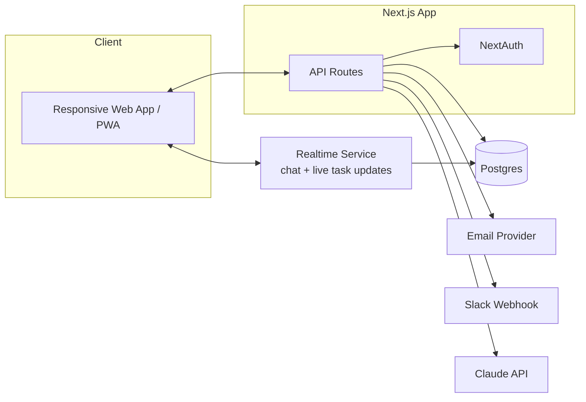
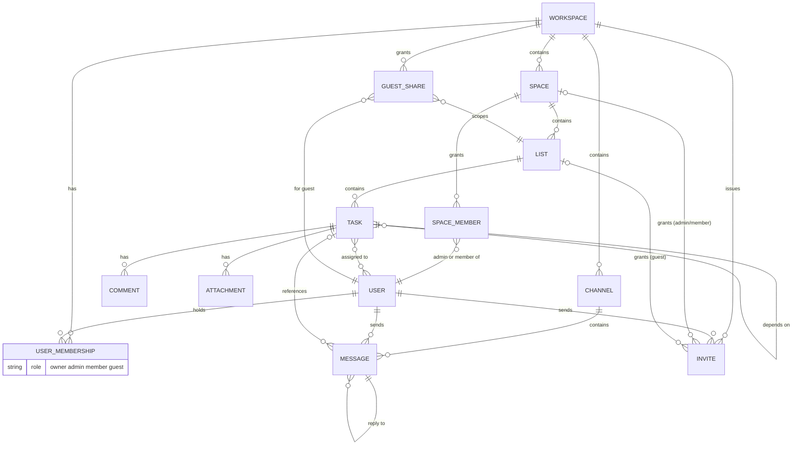

# Architecture

## Stack

| Layer | Choice | Why |
|---|---|---|
| Frontend + API | Next.js (React) | One codebase, server and client routes together, no separate backend service to run |
| Database | Postgres | Relational data (workspace -> space -> list -> task) fits relational, not document |
| ORM | Prisma | Type safe queries, migrations, works well with Next.js |
| Auth | NextAuth | Handles sessions, roles, and guest style restricted accounts without hand rolling auth |
| Styling | Tailwind CSS | Responsive by default, matches the mobile friendly requirement without extra work |
| Realtime | WebSockets (Socket.io or a managed service like Ably/Pusher) | Chat needs real real-time, unlike the task board which can tolerate polling. One realtime layer serves chat and live task updates |
| AI | Claude API | Task summarization, subtask generation, chat draft replies (Phase 2) |
| Notifications | Email (Resend/Postmark) + Slack incoming webhook | Both are simple API calls, no separate notification service needed |
| Hosting | Cloud Run (app, custom server) + managed Postgres (Neon) | Minimal ops for a small team; Cloud Run also holds the WebSocket connections chat needs — see `docs/06-gcp-migration.md` |

Decision to reconsider: Socket.io vs a managed realtime service. Socket.io is free and self hosted but is another process to run and scale. A managed service (Ably/Pusher) costs money but removes the ops burden. Default to the managed service for v1, revisit if cost becomes a real issue.

## System diagram

## Data model

Key points:
- `GUEST_SHARE` is what makes guest access work. A guest user has a membership with role `guest`, and one or more `GUEST_SHARE` rows scoping them to specific lists. Every query that touches task data for a guest filters through their `GUEST_SHARE` rows, not through space level permissions.
- `SPACE_MEMBER` is what makes Admin/Member scoping work. `USER_MEMBERSHIP.role` says what *kind* of account someone has (can they invite people, are they billing-level); `SPACE_MEMBER` says *which spaces* an Admin or Member actually has access to. The Owner bypasses this and always sees every space.
- `INVITE` is the only way accounts get created (no public signup), including the Owner: `src/instrumentation.ts` runs once on server start and, if `SEED_OWNER_EMAIL` isn't registered as Owner yet, creates an `INVITE` for it exactly like any other invite (`invitedById` is nullable for this system-generated case). A token carries the target role and, depending on that role, a target `SPACE` (Admin/Member) or `LIST` (Guest). Accepting an invite only sets the person's password and creates the `USER`, `USER_MEMBERSHIP`, and the corresponding `SPACE_MEMBER`/`GUEST_SHARE` row — it never signs them in, they land on `/login` afterward. Someone already in the workspace is never re-invited; role changes (Admin/Member) happen directly via `setMemberRole`, Owner-only.

## Mobile friendly approach

- Tailwind's responsive utilities handle layout, no separate mobile codebase
- PWA manifest + service worker for installability and basic offline shell
- No native app in v1, revisit only if push notifications or offline editing become a hard requirement

## Application modularization plan

The current implementation validates permissions, performs domain work, writes to the database, sends notifications, and invalidates the UI from a shared server actions module. That is useful while validating the product, but it gives callers too much knowledge of the implementation and makes permission changes easy to miss. The first architectural refactor will establish an access-control module as the application’s primary authorization seam.

### Access-control module

Its interface will answer authorization questions in terms of the resource the caller wants to act on. Framework adapters provide the authenticated user ID, and callers will not query memberships, `SpaceMember`, or `GuestShare` themselves. The module returns an access context for the requested workspace, space, list, task, or channel, or it returns one consistent forbidden/not-found outcome.

This module owns the detailed role rules:

- Owner access across the workspace
- Admin and Member access through `SpaceMember`
- Guest access through `GuestShare`
- Channel membership
- Cross-workspace checks for every referenced ID

The interface should expose only the operations genuinely needed by callers, such as requiring access to a list or task and requiring permission to manage a space. The Prisma queries and role branching stay inside its implementation. That gives task, invite, chat, and attachment modules one small, consistent seam to use.

### Migration order

Current status: `src/lib/access.ts` owns list and editable-task authorization. `src/lib/tasks.ts` owns task creation, fields, assignees, checklists, custom fields, dependencies, attachment records, deletion, and intra-space moves. Server Actions provide session lookup, file storage, notification delivery, and route refresh.

`src/lib/rally-app-data.ts` owns Prisma read queries, include shapes, and database-to-UI mapping. The root page handles authentication, redirect handling, and app rendering.

`src/lib/rally-types.ts` owns shared view types. Client workflows and server read modules now share one source for task, list, space, chat, notification, and app-prop types.

1. Introduce the access-control module without changing user-visible behavior.
2. Move one vertical slice at a time, starting with task mutations, behind a task module that owns validation, authorization, persistence, and notification decisions.
3. Reduce each server action to a framework adapter: parse input, invoke one domain operation, and refresh the relevant route.
4. Extract the root page’s reads and Prisma-to-UI mapping into a dedicated read module. Route files should compose data and UI rather than encode domain rules.
5. Split the client application by workflow (task board/detail, chat, workspace management, and settings), retaining the server as the source of truth.

The access-control module is deliberately first: it produces the most leverage, because every subsequent module can rely on its interface instead of reproducing permission logic. No transport or persistence port will be introduced until there is a real second adapter, such as a production object-store attachment adapter alongside the local-development filesystem adapter.
